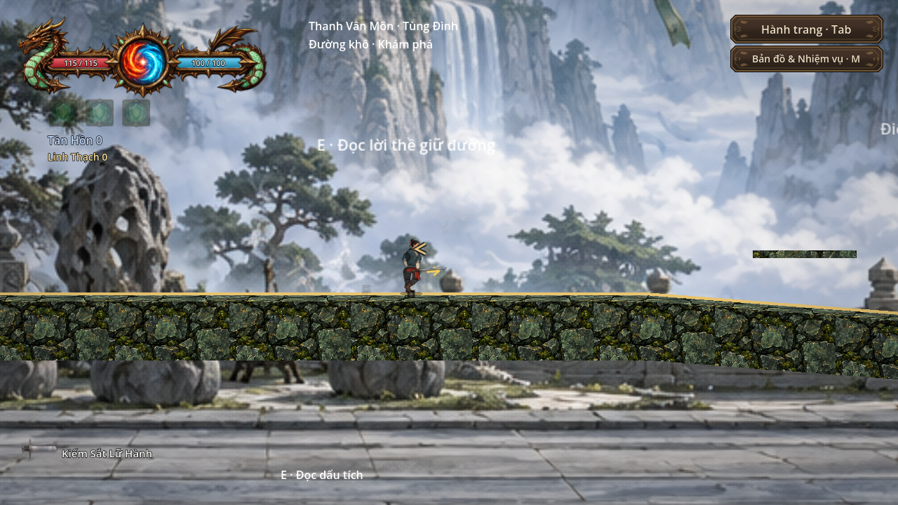

# Dungeon Resonance — Godot 4 prototype

**Dành cho thành viên:** đọc [dự án và cốt truyện](docs/team/PROJECT_AND_STORY.md) rồi [hướng dẫn bắt đầu](docs/team/START_HERE.md). Có [kế hoạch/owner](docs/team/TEAM_PLAN.md), [map](docs/team/MAP_GUIDE.md), [bùa](docs/team/SPELL_GUIDE.md), [nhân vật](docs/team/CHARACTER_GUIDE.md), [skill portable](docs/team/AI_SKILL_GUIDE.md), [QA](docs/team/QA_AND_HANDOFF.md) và [backlog](docs/team/BACKLOG.md). Repo [mminhnhut4/dungeon-resonance](https://github.com/mminhnhut4/dungeon-resonance) hiện **public**, thành viên có thể xem/tải không cần đăng nhập. Dùng nhánh **main** để xem nguồn mới; ZIP release bàn giao đầu ngày là snapshot lịch sử. Source chưa phải game export.

**Chơi thử ZIP mới trên Windows:** giải nén toàn bộ, mở `CHAY_GAME.cmd`, nhập đường dẫn Godot **4.7.2 stable** đang có. Launcher chọn đúng main và dùng save chơi thử riêng. [Cách chạy và xử lý cổng E](docs/team/HOW_TO_RUN_GAME.md) · [Biên bản kiểm tra gói/cổng](docs/team/PORTAL_PACKAGE_VERIFICATION.json). Đây là gói source, chưa có game EXE độc lập.

**Hiện hành 08/10/2026:** tuyến Golem nối tầng4–8; bốn map Thanh Vân/Xích Lô và hai nhiệm vụ mở sân trong đã ghép. Core có học/chế bùa, mana tối đa, hướng dẫn tiến triển và giảm chi phí mastery/save. Gia nhập, đồng hành, nhân chứng/truy nã và kế nhiệm vẫn là thiết kế. [Dự án + cốt truyện + hướng phát triển + ảnh game](docs/team/PROJECT_AND_STORY.md) · [Cách chơi hiện tại](docs/HUONG_DAN_TIEN_TRINH_20261008.md) · [Nghiệm thu và giới hạn](docs/SECT_MAPS_RESUME_20261008.md).


Ảnh native bản chính 08/10, fixture kiểm thử; không phải benchmark hoặc playtest tự nhiên:



[Cốt truyện đề xuất “Hai lời thề giữ đường” và các bước tiếp theo](docs/team/PROJECT_AND_STORY.md#cốt-truyện-mở-rộng-đề-xuất-hai-lời-thề-giữ-đường).

**Các mốc phía dưới là lịch sử; xem trạng thái08/10 ở đầu trang.**

**2026-10-03:** opening/save/QA mặc định OFF, resident P2, polish quái hiện hữu và khung cổ vàng–đỏ chỉ có tên khu vực đã áp dụng vào dự án. Full strict trực tiếp đạt148gate/8.639check,170script/33scene; GPU trực tiếp519check/86ảnh thực. Xem [Project State](docs/PROJECT_STATE.md) để phân biệt phần đang chạy, các mốc lịch sử và phần thiết kế/worker chưa kích hoạt. Bản sửa NPC/cửa hàng5.666check/GPU31capture ngày2026-10-02 được giữ tại [báo cáo lịch sử](docs/TARGETED_REPAIR_20261002.md).

Godot **4.7.2**, GDScript, Compatibility, offline. Prototype có HUD khung rồng với TextureProgressBar, icon bùa/vũ khí, Player concept PNG, Slime/Golem/bia/rương PNG alpha, bục/cột đá AtlasTexture, canvas glow, arc kiếm khí bạc/jade, hạt đuôi phép, âm thanh tổng hợp và Skeleton2D. Player hiện có rig modular dùng cutout PNG/AtlasTexture và animation đọc clock gameplay; atlas bộ khởi đầu đã tích hợp. Xem [nền tảng nhân vật](docs/CHARACTER_FOUNDATION.md). Resident còn dùng hình vector tạm; chưa export Steam.

Mở project.godot và chạy main bằng F5. Main hiện là `scenes/maps/prologue_hub.tscn`, bắt đầu tại **Căn Cứ Lữ Khách** dùng ExteriorHub. Đến **Đường Bộ** và tương tác E/tay cầm X để đi theo tuyến ngoại cảnh; Esc/B hoãn khung tên vùng. Cổng Hub vẫn đưa vào campaign hiện hữu. Menu Tế Đàn/Alpha của các scene legacy không phải entrypoint main hiện tại. Phòng thử riêng: scenes/test_level.tscn → Run Current Scene.

- A/D hoặc ←/→: chạy; Space/W: nhảy; Shift/K: dash.
- Chuột trái/J: attack; chuột phải/I: cast; hướng theo cursor.
- Q: vũ khí; E: nhặt/mở/tương tác; Tab: khảm bùa, time 10%; C: wounds/crafting/relics.
- Phím **` / ~** (dưới Esc): bật/tắt chữ debug, mặc định tắt. Camera zoom1.35, bám chuột tối đa40px; kiếm/dao dùng Kiếm Sĩ, trượng dùng Thuật Sĩ. Xem [Camera và hai ngoại hình](docs/GAME_FEEL_SKINS.md).
- QA tools **mặc định tắt** trong main: F5–F8 và API cấp đồ/nội dung debug đều bị chặn. Chỉ fixture opt-in `qa_tools_enabled` mới dùng các shortcut QA đó. Trong editor F5/F6 vẫn là shortcut chạy scene.

Tiến độ và hướng dẫn chi tiết: [Dynamic Combat Polish](docs/DYNAMIC_COMBAT_POLISH.md), [Run và căn cứ tu luyện](docs/CULTIVATION_RUN_ROADMAP.md), [Full Visual](docs/COMBAT_ART_POLISH.md), [Polish Report](docs/MILESTONE_POLISH_REPORT.md), [Player Rig](docs/MODULAR_PLAYER_RIG.md), [Project State](docs/PROJECT_STATE.md), [Architecture](docs/PROJECT_ARCHITECTURE.md), [Content Report](docs/MILESTONE_CONTENT_REPORT.md), [Addon status](docs/ADDONS.md).

Ảnh được phân loại theo [Asset Pipeline](docs/ASSET_PIPELINE.md): Player/NPC trong assets/sprites; sheet đá/cột trong assets/environment/tilesets; props có thư mục riêng. [Art Integration](docs/ART_INTEGRATION.md) mô tả Player lật theo con trỏ, pivot chân/Tween thở và skin đá của Tiền Sảnh. Hitbox/Hurtbox/collider giữ cây vật lý hiện hữu. Nguồn staging được lưu trữ trong docs/verification và bị loại khỏi import.

```powershell
./tests/run_tests.ps1
```

Báo cáo polish lịch sử đạt **2.857/2.857 assertion**, giữ đủ 2.409 mốc Full Visual và thêm 448 cho procedural motion, global hit-stop/modal, audio, VFX, vòng đời Boss/HUD và giao dịch save. Movement55/Combat100 ở cả 60/120 physics Hz và Resolver20 giữ nguyên. Validator103 script/19 scene; import/editor/addon/exit đều đạt. Ở mốc lịch sử đó, preview14ảnh kiểm đến Boss bị giải phóng và cổng chiến thắng; bốn benchmark GPU Tiền Sảnh/Boss đạt gần60/120FPS trên RTX5080. Các số này thuộc checkpoint lịch sử, không thay nghiệm thu08/10 ở đầu README và không chứng nhận cân bằng/gamefeel15–20phút. Xem [verification summary](docs/verification/polish_test_summary.json) và [log cuối](docs/verification/hades_juice_strict_suite.log).

Các lượt chẩn đoán có native editor shutdown `0xC0000005` chưa xác định nguyên nhân; gate cuối sạch không chứng minh lỗi gián đoạn đã hết, xem [native audit](docs/verification/full_visual_native_audit.md). Runner giữ mọi ERROR/WARNING và không dùng GameplayOnly thay strict. Aseprite Wizard được cài nhưng tắt chờ thủ công; PNG/SpriteFrames không cần executable.


## Navigation kiến trúc — proposal và đích đến

[Module map, conventions và các batch migration](docs/architecture/README.md) · [History index](docs/history/README.md) · [Nhật ký vấp ngã](<nhật ký vấp ngã/README.md>).

Bộ tài liệu/navigation đã có trên bản chính; bố cục runtime đề xuất chưa migration. Catalog mô tả snapshot để review, không lệnh move hoặc chép đè file. Chờ AI/map handoff chốt trước migration code; các report gate phía trên giữ mốc lịch sử của chúng.
