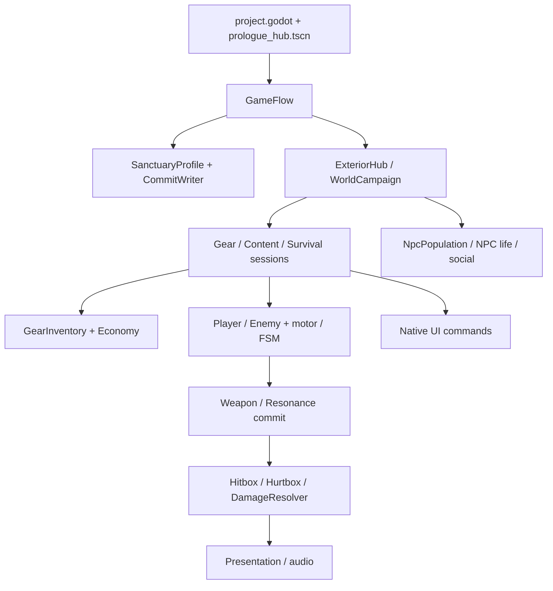

# Module map và dependency

Đề xuất dùng thư mục để cho thấy quyền sở hữu đang có, không tạo service/framework mới. Scene cha và session vẫn nối các component như hiện nay. Tên class, API, ID và nội dung giữ nguyên.

| Module | Path thật/owner hiện tại | Trách nhiệm và dependency | Path đề xuất |
|---|---|---|---|
| Core | `scripts/state_machine/state.gd`, `state_machine.gd`; `scripts/combat/combat_ids.gd`, `time_scale_claims.gd`; `scripts/runtime/profile_json_spans.gd` | State base, ID, clock claim, JSON span; engine/helper. AudioManager là service âm thanh hiện hữu, có dependency sound-bank riêng cần giữ. | `scripts/core/state_machine`, `ids`, `clocks`, `persistence`, `audio` |
| Combat/actor | `scripts/actors/player/player.gd`, `player_motor.gd`, 2 FSM; `scripts/actors/enemies/base_enemy.gd`; `scripts/combat/weapon.gd`, `damage_event.gd`, `hurtbox.gd`, `damage_resolver.gd` | Motor là owner movement; Weapon/Spell emit damage; Hurtbox/Resolver/Health resolve một lần. Combat↔items/talisman là các hợp đồng hiện có, không tự phá vì đổi folder. | `scripts/gameplay/actors`, `scripts/gameplay/combat` |
| Items | `scripts/runtime/gear_item.gd`, `gear_inventory.gd`, `economy_session.gd`, codec/stats/affix/relic; `scripts/definitions/WeaponData.gd`; `scripts/resources/equipment_data.gd`, `weapon_variant_catalog.gd` | Definition immutable; runtime UID/quality/+level/affix riêng. Economy giữ transaction/rollback; một UID ledger, không thêm inventory owner thứ hai. | `scripts/gameplay/items`, `definitions`, `loot` |
| Talisman | `scripts/spells/resonance_resolver.gd`, `resonance_controller.gd`, `spell_executor.gd`, snapshot/context; `scripts/runtime/catalyst_runtime.gd`, `loadout_runtime.gd`; Rune/Catalyst/Resonance definitions | Resolver thuần: sort đủ multiset và đếm duplicate, không subset. Controller/executor commit snapshot, cooldown, proc budget và entity lifecycle. | `scripts/gameplay/talisman`, `runtime`, `definitions` |
| Cultivation | `scripts/cultivation/opening_cultivation_state.gd`, skill/style/binding; session/panel/adapter | State và skill riêng; existing profile transaction và actor binding. Panel/adapter là UI/composition, không tự thưởng hay mở nội dung sâu. | state ở `scripts/gameplay/cultivation`; panel ở `scripts/ui/cultivation`; session ở `scripts/world/sessions` |
| Quests | `scripts/runtime/opening_progress.gd`, `courier_progress.gd`; `scripts/ui/opening_quest_cards.gd`, `map_quest_projection.gd`; bounty methods của SanctuaryProfile | Progress/courier và projection đọc dữ liệu; nhận quest/reward vẫn qua native owner profile/hub, không tạo QuestManager mới. Projection đang phụ thuộc UI/world; catalog đề xuất chưa loại dependency đó. | state `scripts/gameplay/quests`; projection đề xuất `projections`, chỉ chuyển sau review seam; Journal vẫn UI |
| World/composition | `scripts/hub/game_flow.gd`, `prologue_hub.gd`; `scripts/world/exterior_hub.gd`, route/progress/room; `scripts/rooms/dungeon_run.gd`, `world_campaign.gd`; Gear/Content/SurvivalSession | GameFlow sở hữu profile và active scene; Hub/run move gear ownership một lần. Session nối domain+UI+presentation nên không bị coi là domain thuần. World/dungeon geometry tách khỏi exterior. | `scripts/world/flow`, `hub`, `dungeon`, `sessions`, `interactions`, `persistence`; giữ `scripts/world` hiện hữu |
| Save application | `scripts/runtime/sanctuary_profile.gd`, `profile_commit_writer.gd` | Profile biết opening/cultivation/world và safe UID ledger; writer biết opaque social fields. Hai file này thuộc application persistence, **không gọi là core thuần**. | `scripts/world/persistence` — hold |
| NPC | `scripts/npc/npc_world_state.gd`, population/pilot/social; `scripts/hub/npc_actor.gd`, npc_catalog | Resident life/schedule/sidecar là NpcWorldState; social receipt ở canonical profile; vendor actor/services khác resident art. | giữ `scripts/npc`; đề xuất `scripts/npc/services` cho vendor sau owner handoff |
| UI | `scripts/ui/inventory_screen.gd`, `quest_journal.gd`, `dialogue_box.gd`, `survival_panel.gd`, region/service cards | View/input/modal gọi command native; không có profile writer hoặc damage owner mới. Preserve plain Label API, focus và scroll. | giữ `scripts/ui`, gom nhánh khi thêm file mới |
| Presentation | `scripts/presentation/slice_presentation.gd`, rig/camera/HUD, Guard frames/sweep, Golem VFX; `scripts/audio/pilgrimage_audio.gd`; `scripts/utils/procedural_animator.gd` | Đọc clock/snapshot/result; finite budgets/owner cleanup; không mở hitbox hoặc phát damage bằng animation. | giữ `scripts/presentation`; room-audio/helpers có thể gom sau |

Sơ đồ diễn tả ownership/pipeline đã đọc, không là import graph. Static scan ghi cả type annotation. GameFlow/PrologueHub/sessions được phép compose domain/UI/presentation; folder rename không tự loại phụ thuộc hai chiều.

Hotspots: PlayerVisualRig865 dòng, PrologueHub834, SanctuaryProfile751, InventoryScreen661, SlicePresentation537. DamageEvent được 36 script tham chiếu, Player34, GearItem28, GearInventory25, SanctuaryProfile23; các số chỉ đếm product class/type refs, chưa gồm tests/scenes/preload. Không tách các file lớn ngay khi đang có owner và chưa xác định seam.

Data/assets/scenes giữ namespace hiện hữu: `data/gear_variants`60, `data/resonances`18, `data/enemies`4, `assets/sprites`, `assets/ui`, `assets/audio`; main/legacy scene paths không đổi. `scripts/definitions` và `scripts/resources` đang chia theo kỹ thuật thay vì domain; catalog gom logical ownership trước khi đổi physical path.
