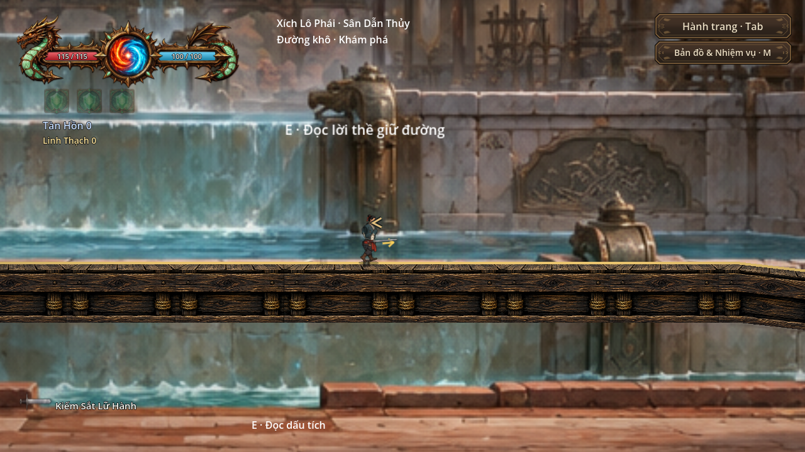
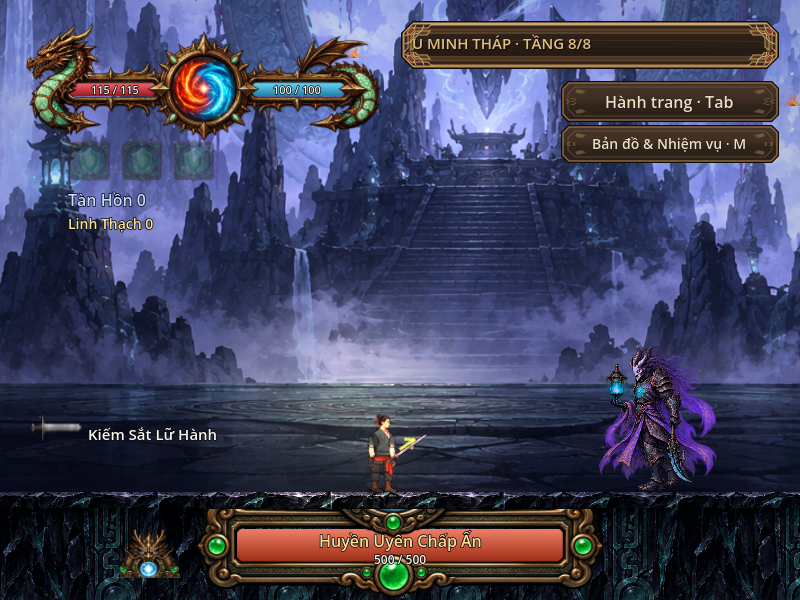

# Dungeon Resonance — dự án, cốt truyện và hướng phát triển

Cập nhật **08/10/2026**, đối chiếu checkpoint nguồn `9bf5bba` và runtime đã ghép `525355d`. Đây là tài liệu đọc nhanh cho cả nhóm. Các mục “đã có” mô tả phần đã nối vào game; cốt truyện mở rộng và các mốc tương lai vẫn cần review, triển khai và chơi thử.

## Game đang làm gì?

Dungeon Resonance là game hành động 2D offline mang bối cảnh tu tiên, hướng tới Steam. Người chơi chuẩn bị tại **Căn Cứ Lữ Khách**, khám phá đường bộ hoặc xuống hầm ngục, chiến đấu, mang chiến lợi phẩm về kho, rèn trang bị và tiếp tục tu luyện.

**Trang bị quyết định class và bộ đòn. Ô Bùa, ghép bùa và cộng hưởng là cơ chế tấn công chính.** Năm nguyên tố Hỏa/Phong/Lôi/Băng/Độc tạo mười cặp cộng hưởng. Hướng đánh và tung chiêu theo con trỏ 360°. Cảnh giới và công pháp bổ trợ hành trình; hướng phát triển giữ vai trò của gear và bùa.

Vòng chơi hiện tại: căn cứ → chuẩn bị vũ khí/bùa → chọn chuyến → đánh/khám phá/nhặt → đi tiếp hoặc về sớm → gửi vật liệu/rèn/học bùa/tu luyện → chuyến tiếp theo. Mục tiêu run 15–20 phút là định hướng để playtest, chưa là thời lượng đã nghiệm thu.

## Mạch truyện đang xuất hiện trong game

Người chơi là một lữ khách khám phá hầm ngục và phù trận cổ. **Thanh Vy** nói về bùa bị oán khí ăn mòn và giúp người chơi chuẩn bị; **Thiết Lão** phụ trách sửa/rèn/cường hóa. **Vô Danh** giao lời hẹn gắn với Golem và lõi phù trận. Đây là các đầu mối opening hiện hữu, chưa phải toàn bộ một campaign cốt truyện hoàn chỉnh.

Sau Golem, **Lạc Ấn** dẫn đường tới Ngũ Tầng Phong Ấn, nay nối vào chuyến chính thành tầng **4–8**: Vân Thạch → Mộc Căn → Hàn Kính → Xích Lô → U Minh Tháp. Cuối tuyến là **Huyền Uyên Chấp Ấn**. Người chơi có thể chuẩn bị lối tắt tới tầng sâu đã hoàn tất; lựa chọn này không cấp lại chiến thắng hoặc phần thưởng.

Ngoài hầm ngục, Đường Hành Hương và Bến Trầm dẫn tới hai nhánh:

- **Thanh Vân Môn:** từ P03 vào Vân Quan rồi Tùng Đình; Phùng Yên Trúc tiếp nhận ghi chép về đường đi.
- **Xích Lô Phái:** từ B04 vào Đê Đất Đỏ rồi Sân Dẫn Thủy; Tống Hồng Diệp tiếp nhận ghi chép về tuyến nước.

Hai nhiệm vụ hiện tại yêu cầu nhận việc, đến hai mốc quan sát, ghi bằng E rồi trình sổ. Hoàn tất mở **quyền khách vào sân trong**. Quan sát địa hình chưa là bằng chứng kết tội một phái; quyền khách chưa là tư cách đệ tử hay chưởng môn. Chấp sự dưỡng thương vẫn có sổ nhận nhiệm vụ để tránh khóa tiến trình.

Chi tiết cách chơi: [đường tiến triển hiện hành](../HUONG_DAN_TIEN_TRINH_20261008.md).

## Cốt truyện mở rộng đề xuất: “Hai lời thề giữ đường”

Đây là mạch truyện đã ghi trong [roadmap tông môn](../SECT_STORY_ROADMAP_20261008.md), **chưa triển khai trọn tuyến nhiệm vụ**.

Những chuyến hàng vật liệu phù trận qua Bến Trầm có dấu niêm không khớp. Thanh Vân nghi xưởng hạ lưu che giấu vật liệu nhiễm oán khí; Xích Lô nghi trạm trên núi ghi sai để giành quyền kiểm soát đường. Người chơi thu thập hai phía lời kể, đối chiếu hồ sơ với dấu niêm dưới phong ấn, rồi làm rõ phần chứng cứ còn thiếu.

Nguyên nhân cuối được đề xuất là phù trận cổ mất đồng bộ và hồ sơ chuyển giao thất lạc. Một số người che sai sót vì sợ bị quy trách nhiệm. Hạnh và Lạc Ấn hỗ trợ đối chiếu; chưa chốt họ là kẻ chủ mưu. Hai phái có động cơ và trách nhiệm riêng, tránh kết luận cả phái tốt/xấu từ một cá nhân.

Tuyến này hướng tới học công pháp, gia nhập, luận võ có đồng thuận và khả năng kế nhiệm chưởng môn. Chức lãnh đạo là trách nhiệm sau khi chứng minh năng lực và hồ sơ, không tự nhận vì đánh hạ một NPC. Tên nhân vật mới, điều kiện, giá và phần thưởng cụ thể trong roadmap cần review ở từng lát cắt.

Các luật đã chốt cho phần tương lai:

- NPC trọng thương/rút lui, không chết vĩnh viễn; ký ức và tiến trình phải được giữ.
- Cả phái biết vụ việc qua nhân chứng, báo tin hoặc bằng chứng. Cá nhân tự vệ không đồng nghĩa toàn phái lập tức biết.
- Tự vệ trước người chủ động truy sát không tăng truy nã; đánh người đang rút lui là vụ gây hấn mới.
- Đồng hành: thuê một người cho một chuyến, trả trước phí Linh Thạch cố định, không chia loot. Cơ chế thuê chưa có trong runtime.

Hợp đồng chi tiết: [thiết kế nhân quả](../SECT_CAUSALITY_DESIGN_20261008.md).

## Phân biệt hiện tại và tương lai

| Phần | Trạng thái hiện tại |
|---|---|
| Combat, trang bị, bùa/cộng hưởng, loot, kho/rèn/save | Có runtime; trị số prototype còn cần cân bằng và playtest |
| Học/chế bùa, tăng mana tối đa, tooltip đồ, xác nhận mua | Đã ghép core ngày 08/10 |
| Tuyến Golem → tầng 4–8; chọn lại tầng sâu đã vượt | Đã ghép, giữ actor/session/UID và tiến độ |
| Bốn map môn phái, hai chấp sự, hai nhiệm vụ mở sân trong | Đã ghép và có native QA; quyền khách |
| Gia nhập, công pháp riêng từng phái, thuê đồng hành | Thiết kế; chưa chơi được như một hệ hoàn chỉnh |
| Nhân chứng/báo tin/truy nã cấp phái, khiêu chiến/kế nhiệm | Thiết kế; chưa có runtime đầy đủ |
| Phòng thứ ba mỗi phái, thêm tầng/quái/moveset mới | Roadmap cần scope và owner, chưa là nội dung đã nối |
| Steam build/store | Đích phát triển; repo là source, chưa phải game export |

## Hướng phát triển cho nhóm

| Thứ tự | Việc cần làm | Kết quả cần bàn giao |
|---|---|---|
| 1 · ổn định bản đang chơi | Đo khựng còn lại, tải map, native cleanup crash; chơi opening và tuyến 1–8 tự nhiên | Lỗi tái hiện được, log/frame-time, fix hẹp và hồi quy phù hợp |
| 2 · rõ hành động và mục tiêu | Polish animation/VFX/UI/NPC/map hiện hữu; kiểm bùa từ hành trang thật | Hướng/pha đòn/va chạm đọc được, quest rõ và lifetime sạch |
| 3 · một lát cắt truyện | Chọn một nhiệm vụ đối chiếu dấu niêm hoặc một bước gia nhập, review trước viết | Input → quest → kết quả → lưu/tải chạy được, không trao thưởng lặp |
| 4 · nhân quả và quan hệ | Thiết kế owner/schema/budget trước nhân chứng, truy nã, đồng hành | State hữu hạn, retry/rollback và save cũ được giữ |
| 5 · công pháp và kế nhiệm | Một phái, một thử thách, một công pháp trước khi mở rộng | Giữ gear-driven/bùa primary, thua/rút lui không khóa tuyến |
| 6 · thêm nội dung và hướng Steam | Tầng nhiều khu, quái riêng, export/offline/UI/audio trên máy mục tiêu | Lát cắt đã duyệt, chơi tự nhiên và kiểm hiệu năng; chưa đặt ngày phát hành |

Mỗi người nhận một task và owner trong [BACKLOG](BACKLOG.md). Dùng nhánh riêng, PR với acceptance/evidence; **một integrator ghép main**, chỉ một lượt GPU nặng tại một thời điểm. Không mở hệ mới để tránh lỗi của nội dung đang chơi. [Kế hoạch nhóm](TEAM_PLAN.md) · [mẫu task](TASK_TEMPLATE.md).

## Ảnh game hiện hành và giới hạn kiểm chứng

Các ảnh dưới lấy nguyên từ native QA trên bản chính ngày 08/10; xem [nguồn và receipt](evidence/current_20261008/README.md). Fixture có setup kiểm thử; ảnh không chứng minh chơi tự nhiên hoặc FPS.

Báo cáo nghiệm thu trước lượt upload: strict **273/273** trên candidate frozen, hậu kiểm main validator/save/native. Các kết quả này thuộc checkpoint đã ghi, không phải kiểm thử mới của lượt cập nhật tài liệu. Lượt import main đầu đã crash rồi retry sạch; nguyên nhân native cleanup vẫn chưa xác định. Chuyển map từng có 56–104 ms, combat còn đỉnh trong mẫu; chưa chứng nhận hết lag. [Báo cáo và giới hạn](../SECT_MAPS_RESUME_20261008.md).

## Thành viên bắt đầu ở đâu?

Clone repo private sau khi được cấp quyền, dùng **Godot 4.7.2 stable / Compatibility**, mở `project.godot`, F5 chạy `scenes/maps/prologue_hub.tscn`. Chơi thử với save riêng. Bản ZIP release `team-handoff-20261008-fe4017e` là snapshot cũ; để xem nguồn hiện hành dùng nhánh **main**, `git pull --ff-only` trên checkout sạch hoặc **Code → Download ZIP**.

[Bắt đầu](START_HERE.md) · [Map](MAP_GUIDE.md) · [Bùa/skill](SPELL_GUIDE.md) · [Nhân vật](CHARACTER_GUIDE.md) · [Skill Codex](AI_SKILL_GUIDE.md) · [QA](QA_AND_HANDOFF.md) · [Trạng thái nguồn](../PROJECT_STATE.md).
