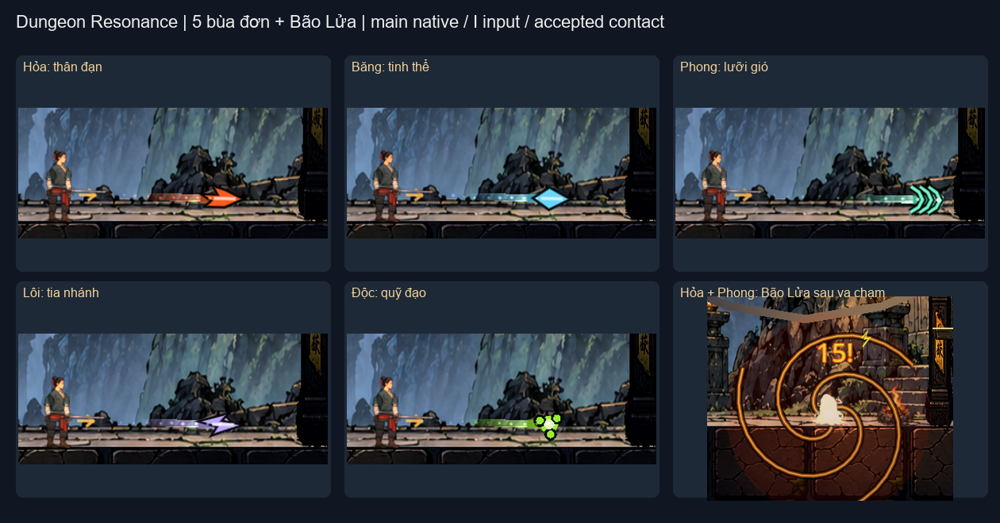
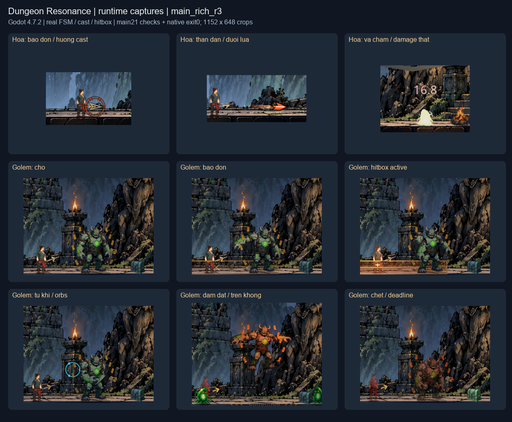
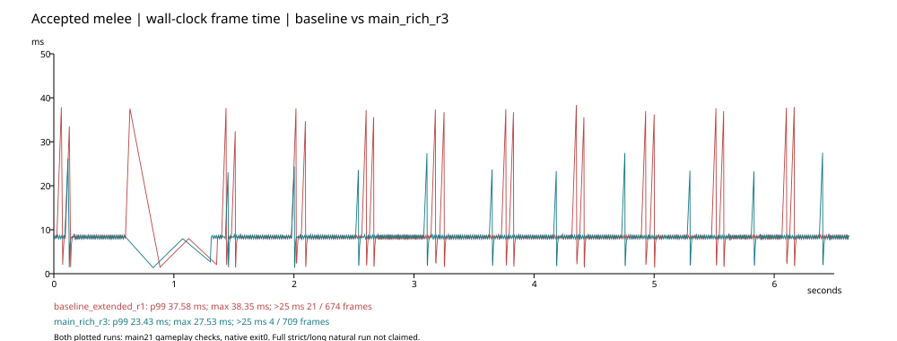

# Bằng chứng đi cùng gói nhóm

Ảnh contact sheet và biểu đồ frame-time chép từ lượt combat thực ngày2026-10-07. [Báo cáo gốc](../../COMBAT_VISUAL_FIX_20261007.md); FRAME_METRICS.json giữ số đo đối chiếu.

Mẫu normal1152×648/RTX5080/cap120, physics60, vsyncOFF; screenshot readback ngoài đo. Còn synchronous save peaks và hitstop; không đại diện mọi GPU/trận/10cặp. Raw receipts/failed runs đầy đủ ở máy tác giả trong docs/verification/combat_visual_20261007; gói không mang toàn bộ log/save.
